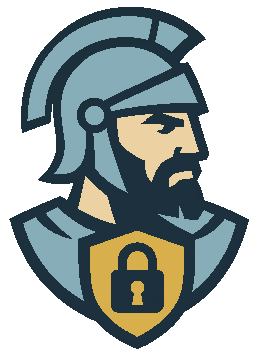

**Contenidos**

- [1. Proyecto Pass Warriors](#1-proyecto-pass-warriors)
    - [1.1. Backend](#11-backend)
    - [1.2. Base de Datos](#12-base-de-datos)
    - [1.3. Frontend](#13-frontend)

# 1. Proyecto Pass Warriors
Este proyecto está siendo desarrollado como proyecto de fin de Grado Superior de **DAW** (Desarrollo de Aplicaciones Web)

La **aplicación web** es un **gestor de contraseñas** que permite a los usuarios **almacenar** y **compartir** contraseñas de forma **segura**. Además, dispone de un **generador de contraseñas** que permite generar contraseñas **aleatorias** y **seguras**.

Se puede probar en [https://passwarriors.es](https://passwarriors.es)

## 1.1. [Backend](./api/README.md)
Contiene el código del ***backend*** (API) de la aplicación

## 1.2. [Base de Datos](./db/README.md)
Contiene el diseño de la **base de datos** (entidades y relaciones) y el código `SQL` con la estructura de ésta y datos de ejemplo

## 1.3. [Frontend](./frontend/README.md)
Contiene el código del ***frontend*** (interfaz de usuario) de la aplicación
